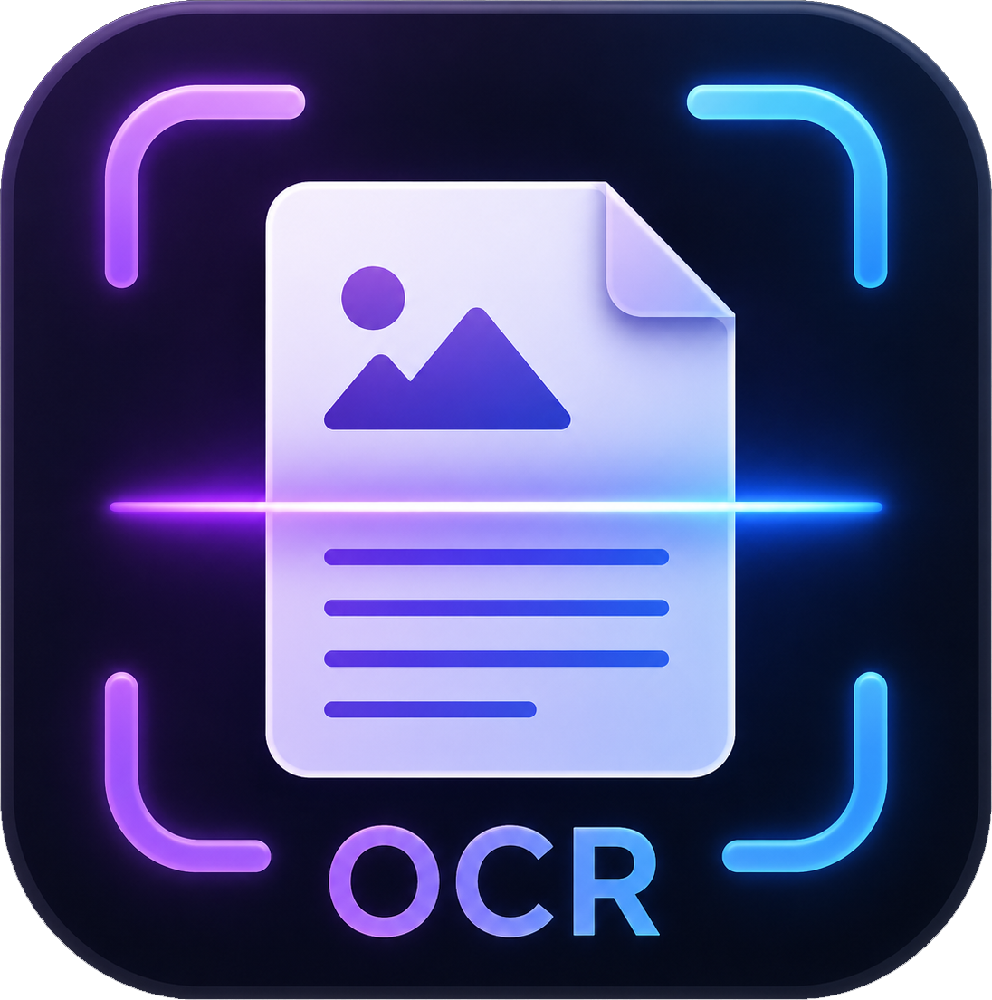

# Icono — Image Crop OCR & Icon Maker

A modern PyQt6 desktop application to capture screen areas or load images, extract text using Tesseract OCR, and convert images to Windows icon (`.ico`) format.



## Features

- **📷 Capture Screen** — fullscreen overlay with drag-to-select region
- **📁 Open Image** — PNG, JPG, BMP, TIFF, WEBP
- **📋 Paste from Clipboard** — paste any copied image
- **⚡ Extract Text** — OCR with Tesseract (English / Bangla / both)
- **® To Icon** — convert any PNG/JPG to `.ico` (16×16 to 256×256)
- **📋 Copy Text** — one-click clipboard copy
- **🖼 Image Preview** — with drag-to-crop selection
- **🌙 Dark Mode** — modern dark UI theme
- **Language support** — English, Bangla, Bangla+English

## Requirements

- Windows 10 / 11 (64-bit)
- [Tesseract OCR](https://github.com/UB-Mannheim/tesseract/wiki)
- Python 3.9+

## Quick Start

### 1. Install Tesseract OCR

Download and install from: [UB-Mannheim/tesseract](https://github.com/UB-Mannheim/tesseract/wiki)

Default path: `C:\Program Files\Tesseract-OCR\tesseract.exe`

For Bangla support, select **Bengali** language data during install.

### 2. Run the App

```bash
python -m venv .venv
.venv\Scripts\activate
pip install -r requirements.txt
python app.py
```

Or double-click `run_windows.bat`.

## How to Use

| Step | Action |
|------|--------|
| 1 | Open the app |
| 2 | Click **Open** to select an image, or **Capture** to grab a screen region, or **Paste** from clipboard |
| 3 | (Optional) Drag on the preview to select a specific text area |
| 4 | Choose **Language** from the dropdown |
| 5 | Click **Extract Text** |
| 6 | Click **Copy** to copy the result |

## Icon Converter

1. Click **To Icon** in the toolbar
2. Select a PNG/JPG/BMP image
3. Choose save location — the `.ico` file is generated with sizes: 16, 32, 48, 64, 128, 256px
4. Use the icon for Windows shortcuts, folders, or PyInstaller (`--icon=file.ico`)

## Build Executable

```bash
pip install pyinstaller
pyinstaller --onefile --windowed --name "ImageCropOCR" --icon icon.ico --add-data "icon.ico;." --add-data "icon.png;." app.py
```

Output: `dist\ImageCropOCR.exe`

## Create Installer

1. Run `build.bat` to create `dist\ImageCropOCR.exe`
2. Open `installer.iss` in [Inno Setup](https://jrsoftware.org/isinfo.php)
3. Press **Ctrl+F9** to compile
4. Output: `Icono_Setup_v1.5.exe`

## Project Structure

```
├── app.py              # Main application
├── requirements.txt    # Python dependencies
├── build.bat           # PyInstaller build script
├── build.spec          # PyInstaller spec file
├── installer.iss       # Inno Setup installer script
├── run_windows.bat     # Quick launch script
├── icon.ico            # App icon (Windows)
├── icon.png            # App icon (PNG)
└── .gitignore
```

## Dependencies

- [PyQt6](https://www.riverbankcomputing.com/software/pyqt/)
- [Pillow](https://python-pillow.org/)
- [pytesseract](https://github.com/madmaze/pytesseract)
- [mss](https://github.com/BoboTiG/python-mss)

## License

Non-commercial use.

## Credits

**Rupsha IT Park** — https://www.rupshaitpark.com/
